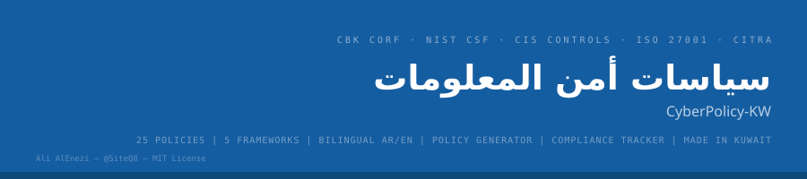

<div align="center">



<br>

[](https://siteq8.github.io/CyberPolicy-KW)
[](LICENSE)
[]()
[]()
[]()

### مستودع سياسات وإجراءات أمن المعلومات — الكويت 🇰🇼

**وجهتك الأولى لإعداد سياسات وإجراءات أمن المعلومات**

[استخدم التطبيق](https://siteq8.github.io/CyberPolicy-KW) · [السياسات](#السياسات-والإجراءات) · [المولّد](#مولّد-السياسات) · [متابعة الالتزام](#متابعة-الالتزام)

</div>

---

## نظرة عامة

مستودع CyberPolicy-KW يحتوي على **30 سياسة وإجراء ومعيار وإرشاد** لأمن المعلومات، جاهزة للتعديل والتطبيق، ثنائية اللغة (عربي + إنجليزي)، متوافقة مع المعايير المحلية والدولية. يتضمن المستودع **مولّد مستندات** يُنتج السياسات بصيغة DOC و PDF، و**أداة متابعة الالتزام المستمر** لتتبع تقدم المؤسسة.

### لمن هذا المستودع؟

| الجهة | الوصف |
|-------|-------|
| **الجهات الحكومية** | الوزارات والهيئات الحكومية الخاضعة لتنظيم CITRA |
| **البنوك والمؤسسات المالية** | المؤسسات الخاضعة لإطار CORF الصادر من بنك الكويت المركزي |
| **القطاع الخاص** | الشركات العاملة في الكويت |
| **المؤسسات الصغيرة والمتوسطة** | المؤسسات التي تحتاج سياسات أساسية لأمن المعلومات |
| **شركات الاستشارات** | الاستشاريون الذين يبنون سياسات لعملائهم |

---

## المعايير المدعومة

| المعيار | الإصدار | الوصف |
|---------|---------|-------|
| **CBK CORF** | v1.0 | إطار المرونة السيبرانية والتشغيلية — بنك الكويت المركزي |
| **NIST CSF** | v2.0 + SP 800-53 | إطار الأمن السيبراني الوطني الأمريكي |
| **CIS Controls** | v8.1 | ضوابط مركز أمن الإنترنت |
| **ISO 27001** | 2022 — Annex A | المعيار الدولي لإدارة أمن المعلومات |
| **CITRA** | — | لوائح هيئة تنظيم الاتصالات وتقنية المعلومات الكويتية |

---

## المميزات

### السياسات والإجراءات
- **30 سياسة وإجراء ومعيار وإرشاد** تغطي جميع مجالات أمن المعلومات
- **ثنائية اللغة** — كل سياسة بالعربية والإنجليزية (الغرض، النطاق، المتطلبات)
- **مرجعية شاملة** — كل بند مرتبط بمعيار محدد (CORF, NIST, ISO, CIS, CITRA)
- **تصفية ذكية** — حسب حجم المؤسسة والمعيار المطلوب
- **عرض تفصيلي** — نافذة عرض لكل سياسة مع جميع التفاصيل

### مولّد السياسات
- **إنشاء مستندات جاهزة** — اختر نوع السياسة وحجم المؤسسة واللغة
- **تحميل DOC** — تحميل المستند بصيغة Word
- **تحميل PDF** — طباعة/تحميل بصيغة PDF
- **قابل للتخصيص** — أضف اسم المؤسسة والمعايير المطلوبة
- **هيكل رسمي** — رقم وثيقة، إصدار، تاريخ، تصنيف، مسؤوليات، مراجعة

### متابعة الالتزام المستمر (Continuous Compliance)
- **7 مجالات رقابية** — الحوكمة، التحكم بالوصول، حماية البيانات، أمن الشبكات، العمليات، التطبيقات، الموارد البشرية
- **متابعة تفاعلية** — علّم كل ضابط عند تطبيقه
- **نسبة الالتزام** — مؤشر تقدم لكل مجال والنسبة الإجمالية
- **حفظ تلقائي** — التقدم محفوظ في المتصفح

---

## السياسات والإجراءات

### الحوكمة وإدارة المخاطر
| # | السياسة | النوع |
|---|---------|-------|
| 01 | سياسة أمن المعلومات | سياسة |
| 02 | سياسة إدارة المخاطر | سياسة |
| 15 | سياسة الأطراف الثالثة والموردين | سياسة |
| 22 | سياسة الاستخدام المقبول | سياسة |

### التقنية والبنية التحتية
| # | السياسة | النوع |
|---|---------|-------|
| 03 | سياسة التحكم بالوصول | سياسة |
| 05 | سياسة إدارة الأصول | سياسة |
| 07 | سياسة التشفير | سياسة |
| 08 | سياسة أمن الشبكات | سياسة |
| 11 | سياسة إدارة الثغرات | سياسة |
| 12 | سياسة أمن التطبيقات | سياسة |
| 13 | سياسة الأمن السحابي | سياسة |
| 16 | سياسة أمن نقاط النهاية | سياسة |
| 21 | سياسة البريد الإلكتروني | سياسة |
| 24 | إجراءات إدارة الهوية | إجراء |
| 25 | معيار التكوين الآمن | معيار |

### البيانات والخصوصية
| # | السياسة | النوع |
|---|---------|-------|
| 04 | سياسة تصنيف المعلومات | سياسة |
| 14 | سياسة حماية البيانات والخصوصية | سياسة |

### العمليات والاستمرارية
| # | السياسة | النوع |
|---|---------|-------|
| 09 | سياسة إدارة الحوادث الأمنية | سياسة |
| 10 | سياسة استمرارية الأعمال | سياسة |
| 18 | سياسة السجلات والمراقبة | سياسة |
| 19 | سياسة الأمن المادي | سياسة |
| 20 | سياسة النسخ الاحتياطي | سياسة |
| 23 | إجراءات إدارة التغيير | إجراء |

### الموارد البشرية
| # | السياسة | النوع |
|---|---------|-------|
| 16 | سياسة أمن الموارد البشرية | سياسة |
| 17 | سياسة التوعية والتدريب الأمني | سياسة |
| 22 | سياسة الاستخدام المقبول | سياسة |

### سياسات جديدة (v2.0)
| # | السياسة | النوع |
|---|---------|-------|
| 26 | سياسة أمن حسابات التواصل الاجتماعي | سياسة |
| 27 | سياسة أمن إنترنت الأشياء والتقنية التشغيلية | سياسة |
| 28 | إرشادات العمل الآمن مع الذكاء الاصطناعي | إرشاد |
| 29 | إجراءات إدارة إعدادات الأمان | إجراء |
| 30 | معيار أمن الشبكات اللاسلكية | معيار |
| 07 | سياسة أمن العمل عن بُعد | سياسة |

---

## الاستخدام

### مباشرة
**[https://siteq8.github.io/CyberPolicy-KW](https://siteq8.github.io/CyberPolicy-KW)**

### محلياً
```bash
git clone https://github.com/SiteQ8/CyberPolicy-KW.git
cd CyberPolicy-KW
open docs/index.html
```

### كيفية الاستخدام

**تصفح السياسات:**
1. اختر **حجم ونوع المؤسسة** (حكومي، مالي، خاص، صغيرة)
2. اختر **المعيار** (CORF، NIST، ISO، CIS، CITRA)
3. اضغط على أي سياسة لعرض التفاصيل الكاملة

**إنشاء مستند:**
1. انتقل لتبويب **مولّد السياسات**
2. أدخل اسم المؤسسة واختر نوع السياسة
3. اختر حجم المؤسسة والمعايير واللغة
4. اضغط **إنشاء المستند** ثم **تحميل DOC** أو **تحميل PDF**

**متابعة الالتزام:**
1. انتقل لتبويب **متابعة الالتزام**
2. علّم كل ضابط عند تطبيقه في مؤسستك
3. تابع نسبة التقدم لكل مجال والنسبة الإجمالية

---

## الرخصة

MIT — مفتوح المصدر بالكامل

---

<div align="center">
  <sub>CyberPolicy-KW — سياسات وإجراءات أمن المعلومات — الكويت 🇰🇼</sub><br>
  <sub><a href="https://github.com/SiteQ8">@SiteQ8</a> — Ali AlEnezi (علي العنزي)</sub>
</div>
